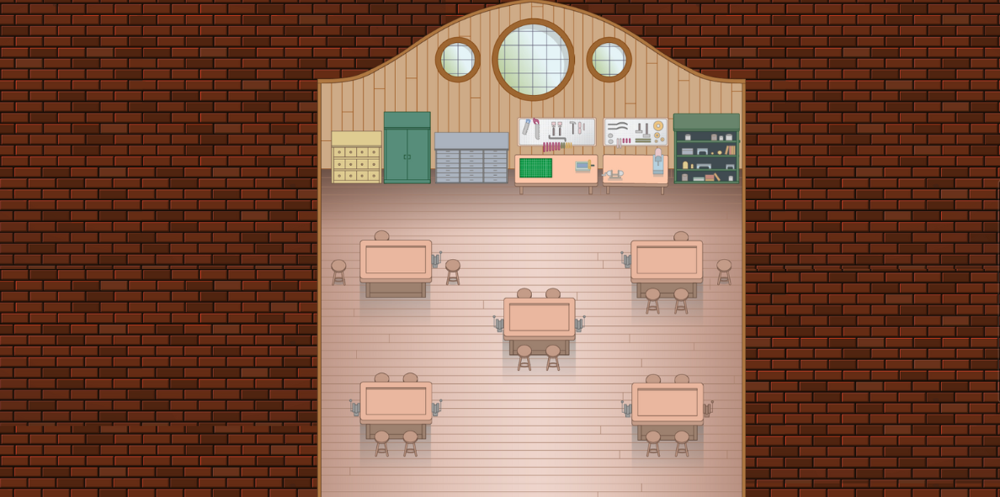

# 100 Roads Design

100 Roads has been designing and innovating in the education space since 2016. Our founder, Catherine Fraise, first designed a physical campus at Workspace Education in Bethel CT.

When lockdowns raised new problems, Catherine moved into developing online learning environments.

100 Roads Design is located in McLeod, Montana and our virtual campuses are created by a global team of digital architects, creatives, community builders and educators.

Learn more about us at https://100roadsdesign.com. 

## About the map

There are 12 virtual campuses in this repository.

Map name: Discovery and Innovations.

Map name: Design Lab.

Map name: Greenhouse.

Map name: Ideas Cafe.

Map name: Makers Space.

Map name: Mechanical Tunnel.

Map name: Nature Scapes.

Map name: Project Foundry.

Map name: Sewing Machine First Floor.

Map name: Sewing Machine Second Floor.

Map name: Storage Room.

Map name: Tea Room.

## Copyright

This map is the sole property of 100 Roads Design LLC. All rights are reserved by 100 Roads Design LLC. All contents of the map may not be reproduced, distributed (for sale or otherwise), or create derivative works of the copyrighted work without the express written permission of 100 Roads Design LLC.